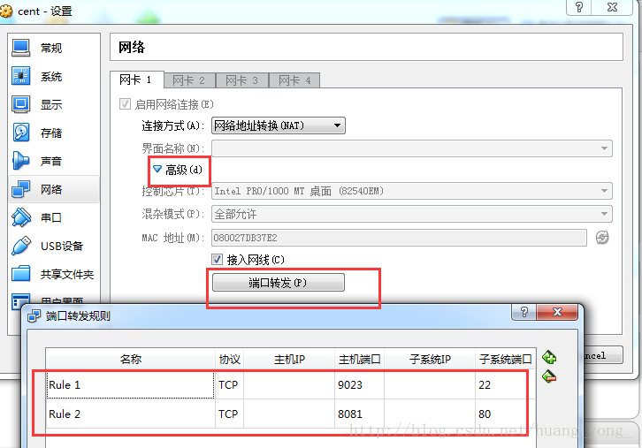
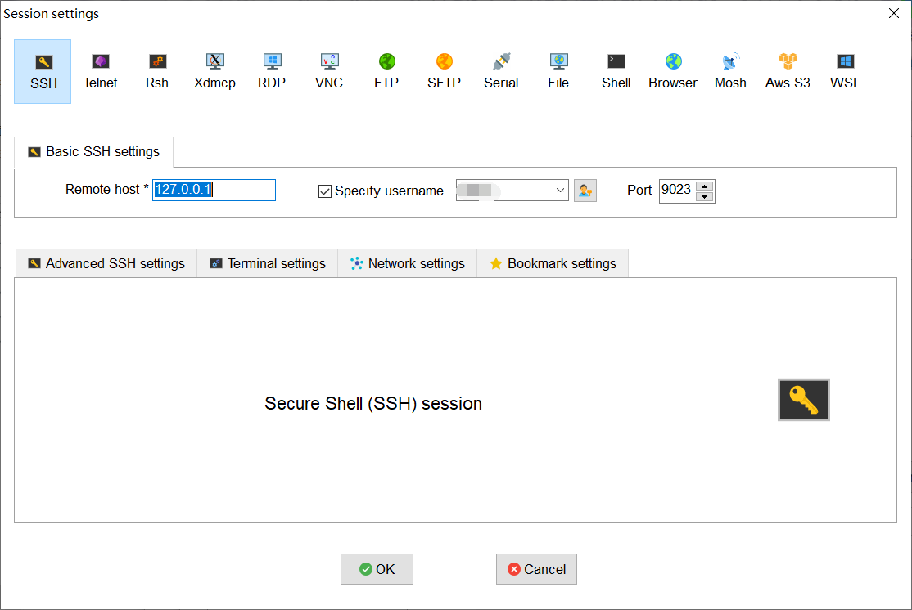

# gitee gomi

#### Desciption
This is a project which gomi is stored in when learning advanced programmming in unix environment teached by Pro zhujinhui of scut, including but not limited testing and learning files.

#### Enviroment

CentOS Linux release 7.7.1908 (Core) in VritualBox 6.1.4

#### Tool

1.  using ***MobaXterm*** V20.1 in windows to connetct centos in VirtualBox 6.1.4
2.  managing version by ***Git***
3.  orangizing code in ***CMake***

#### MARK：How to use shell to connect Linux server in virtualbox

原文链接：https://blog.csdn.net/huang_yong_/article/details/79456284

简单可行，只需配置virtualbox:

> 右键选择virtualbox里的Linux，我这里是以centos7为例子。 
> 右键->设置->网络 
> 连接方式选择 ：网络地址转换（NAT） 
> 然后点高级->端口转发， 
> 如图配置即可： 
> 
>
> 端口转发设置非常重要，shell连接本地ip上的9023端口，即可转发到虚拟机里的22端口。 主机端口和子系统端口可自己定义，根据实际需求设置。
>
> mobaxterm下ssh连接设置如下
>
> 
>
> 这样配置后，会通过ssh连接上本地虚拟机，并进入 配置的特定用户目录下

#### 参与贡献

1.  Fork 本仓库
2.  新建 Feat_xxx 分支
3.  提交代码
4.  新建 Pull Request

#### feature

1.  使用 Readme\_XXX.md 来支持不同的语言，例如 Readme\_en.md, Readme\_zh.md
2.  码云官方博客 [blog.gitee.com](https://blog.gitee.com)
3.  你可以 [https://gitee.com/explore](https://gitee.com/explore) 这个地址来了解码云上的优秀开源项目
4.  [GVP](https://gitee.com/gvp) 全称是码云最有价值开源项目，是码云综合评定出的优秀开源项目
5.  码云官方提供的使用手册 [https://gitee.com/help](https://gitee.com/help)
6.  码云封面人物是一档用来展示码云会员风采的栏目 [https://gitee.com/gitee-stars/](https://gitee.com/gitee-stars/)
