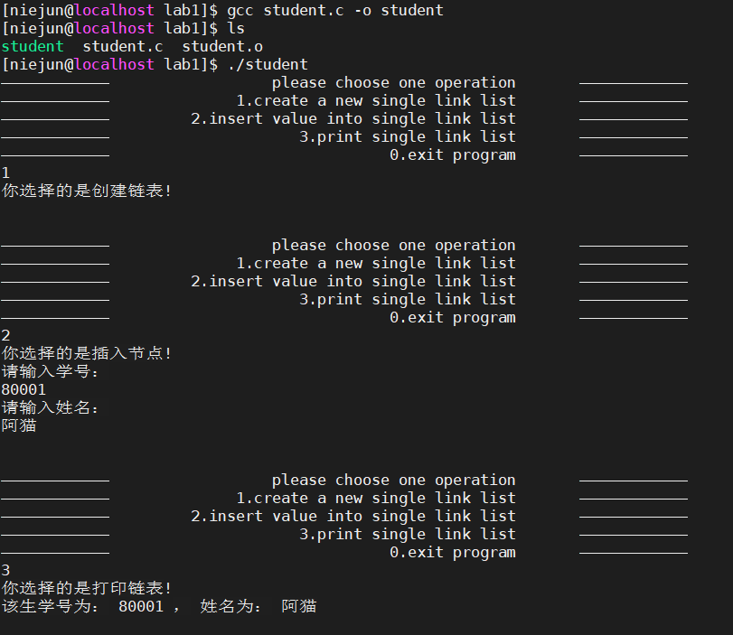

实验运行情况：

1. 先创建个不带头的单向空链表
2. 而后选择插入值
3. 再将链表遍历打印

源代码如下

~~~c
#include <stdio.h>
#include <stdlib.h>

typedef struct student{
    long stu_id;     //学号
    char name[20];   //姓名
    
    struct student *next; //指针域
}student, *List;

struct student *create_list()
{
    struct student *head;
    head = NULL;
    return head;
}
void print_list(List head)
{
	List rear = head;
	if(rear == NULL){
		printf("This list is NULL!\n");
		return;
	}
	printf("该生学号为： %ld ， 姓名为： %s \n", rear->stu_id,rear->name);
	while(rear->next != NULL){
		rear = rear->next;
		printf("该生学号为： %ld ， 姓名为： %s \n", rear->stu_id,rear->name);
	}
	return;
}
List insert_list(List head)
{
	List temp, rear = head;
	temp = (List)malloc(sizeof(student));

	printf("请输入学号：\n");
	scanf("%ld",&temp->stu_id);
	printf("请输入姓名：\n");
	scanf("%s",&temp->name);

	if(head == NULL)
	{
		head = temp;
		head->next = NULL;
	}else
	{
		while(rear->next != NULL){
			rear = rear->next;
		}
		rear->next = temp;
		rear = temp;
		rear->next=NULL;
	}
	print_list(head);
	return head;
}

int main()
{
	List head;
	while(1){
		printf("————————————\t %40s \t————————————\n","please choose one operation");
	    printf("————————————\t %40s \t————————————\n","1.create a new single link list");
	    printf("————————————\t %40s \t————————————\n","2.insert value into single link list");
	    printf("————————————\t %40s \t————————————\n","3.print single link list");
	    printf("————————————\t %40s \t————————————\n","0.exit program");

	    char oper = getchar();
	    
	    switch(oper)
	    {
	    	case '0': 
	        		printf("你选择的是退出程序!byebye!\n");
	        		exit(0);
	        case '1': 
	        		printf("你选择的是创建链表!\n");
	        		head = create_list();
	        		break;
	        case '2': 
	        		printf("你选择的是插入节点!\n");
	        		head = insert_list(head);
	        		break;
	        case '3': 
	        		printf("你选择的是打印链表!\n");
	        		print_list(head);
	        		break;
	        		
	        default: 
	        		printf("invalid operation number!byebye!\n");
	                break;
	                  
	    }
	    printf("\n\n");getchar();
	}
    
}

~~~

