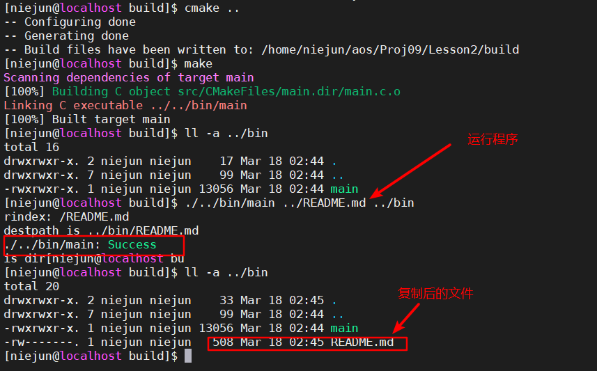
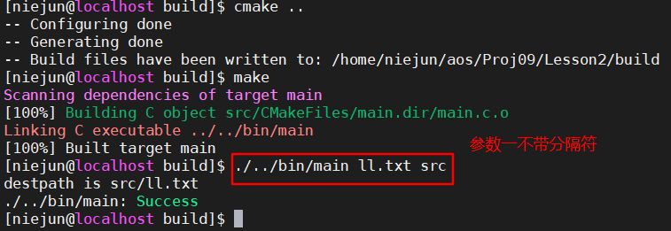

实验二  2020年3月17日

#### 实验内容

仿写cp命令的部分功能（编写mycp程序）：

1. 将源文件复制到另外一个文件（将test1.text复制成test2.txt）
   [test@linux test]$ ***./mycp /home/test1.txt /usr/test2.txt*** 

2. 将源文件复制到另外一个目录（将test1.txt复制到/tmp目录）
   [test@linux test]$ ***./mycp /home/test1.txt /tmp***

源文件路径和目标文件路径通过命令行参数来指定

#### 实验截图

1. 功能一
   
2. 功能二

参数一与参数二不带分隔符/时，

#### 关键代码

##### 功能二

~~~c
//获取源文件的文件名
char *p;
if(NULL == rindex(argv[1],'/'))//如果源文件不包含目录间隔符"/"
{
    p = (char *) malloc(strlen("/") + strlen(argv[1]));
    sprintf(p, "%s%s", "/", argv[1]);
}
else{
    p = rindex(argv[1],'/');
}

//设置目标文件名
char *destpath = (char *) malloc(strlen(p) + strlen(argv[2]));
sprintf(destpath, "%s%s", argv[2], p);
printf("destpath is %s\n", destpath);

int inf = open(argv[1],O_RDONLY, 0);
int outf = open(destpath, O_WRONLY|O_CREAT|O_TRUNC, 0600);
char buf[1024];
int i;
do{//复制文件到目录
    i = read(inf, buf, 4096);
    //printf("%s",buf);//打印buf获取到的内容
    write(outf, buf, i);
}while(i);
~~~

