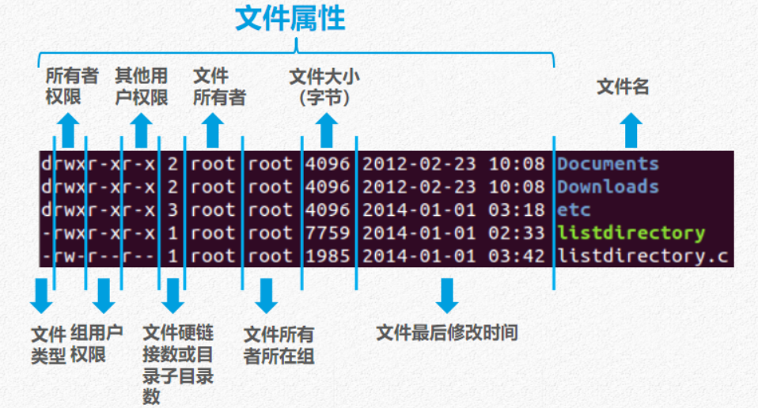
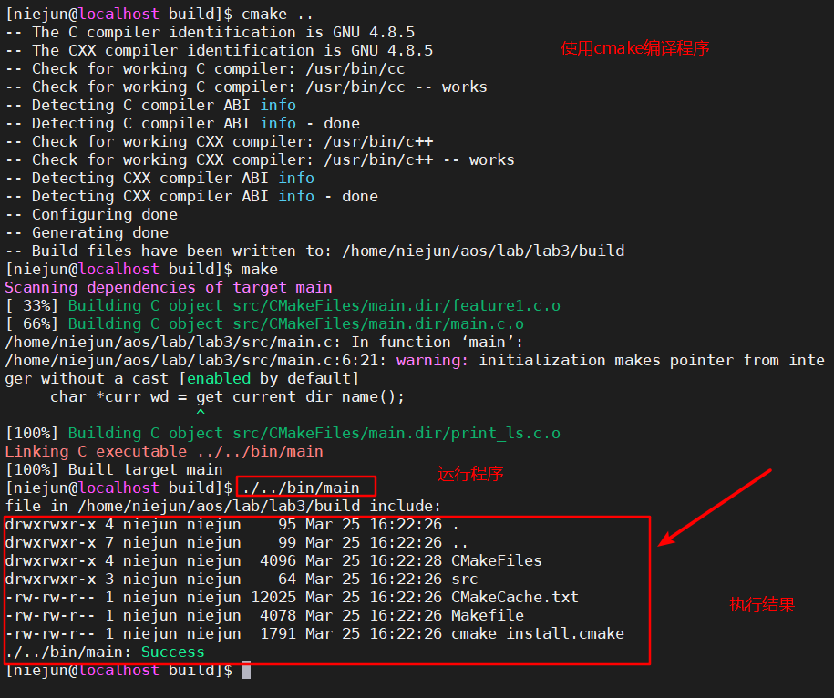
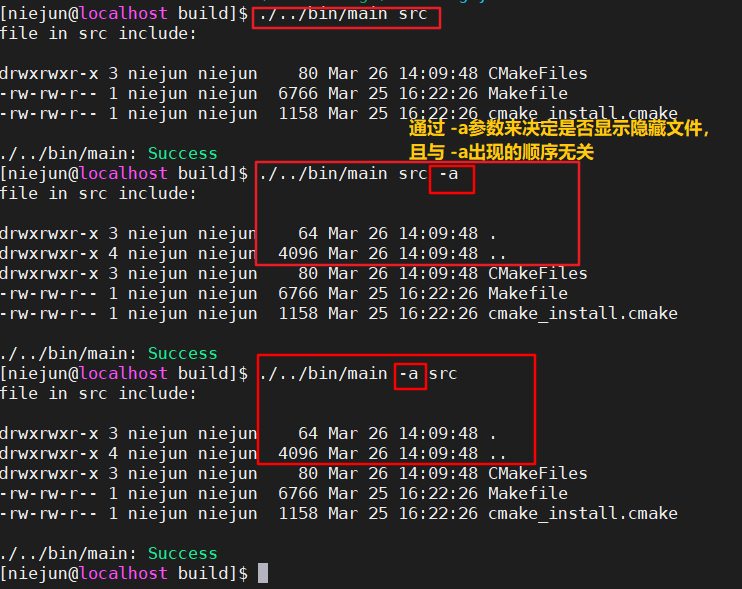
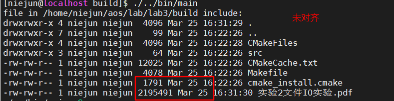

实验三  2020年3月24日 niejun 006

#### 实验内容

仿写ls -l的功能（编写myls程序）,参数通过命令行传入：
1. ***获取当前工作目录路径并对该目录实现遍历***

2. ***仿ls -l以列表形式出当前工作目录下的所有文件（包括子目录)***

需显示的文件属性有：
所有者所在组用户名 文件大小 最后修改时间 文件类型 权限 硬链接数 所有者用户名



#### 实验目的

1. 目的一：掌握Linux目录操作方法
   ✓ 打开目录、关闭目录
   ✓ 读取目录文件
   ✓ 获取Linux文件属性的函数
2. 目的三：掌握文件属性解析相关的重要数据结构、函数、宏和文件掩码等
3. 目的二：掌握Linux文件属性获取方法


#### 实验截图



通过命令行的 -a参数来控制是否显示隐藏文件，该参数可出现再目录的前后



#### 关键代码

```c
char *curr_wd = get_current_dir_name();  //获取当前工作路径
curr_file = (char *) malloc(strlen("/") + strlen(path) + strlen(currentdp->d_name) + 1);
sprintf(curr_file, "%s/%s", path, currentdp->d_name); //设置curr_file为 当前路径/当前文件名

if( stat(curr_file, &curr_stat) < 0)//获取文件的属性，并判断是否获取成功
{
    printf("get stat error\n");
    continue;
}
print_type(curr_stat.st_mode);//打印文件类型
print_perm(curr_stat.st_mode);//打印文件权限
printf("%ld ", curr_stat.st_nlink);//打印文件连接数
print_uname(curr_stat.st_uid);//打印文件 所有者
print_gname(curr_stat.st_gid);//打印文件所有者所在组
printf("%5ld ", curr_stat.st_size);//打印文件大小 字节计算  5个空位右对齐
print_time(curr_stat.st_mtime);//打印文件最后修改时间
printf("%s\n", currentdp->d_name); //打印当前文件名
```


##### 问题思考

> 使用 ll 显示的文件属性中，文件大小会右对齐，目前是固定5个字符右对齐，但如果最大文件大小的长度超过5或小于5 则会显得不整齐，如图所示
> 
>
> 不知道要如何优雅的实现，目前初步想法是 先循环遍历获得整个目录下最大文件的文件大小的长度，以其为基准进行右对齐，但感觉效率很低。


