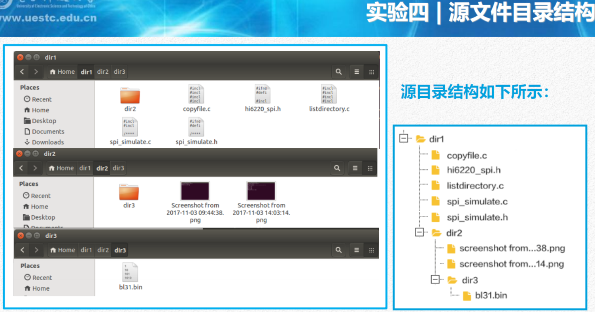
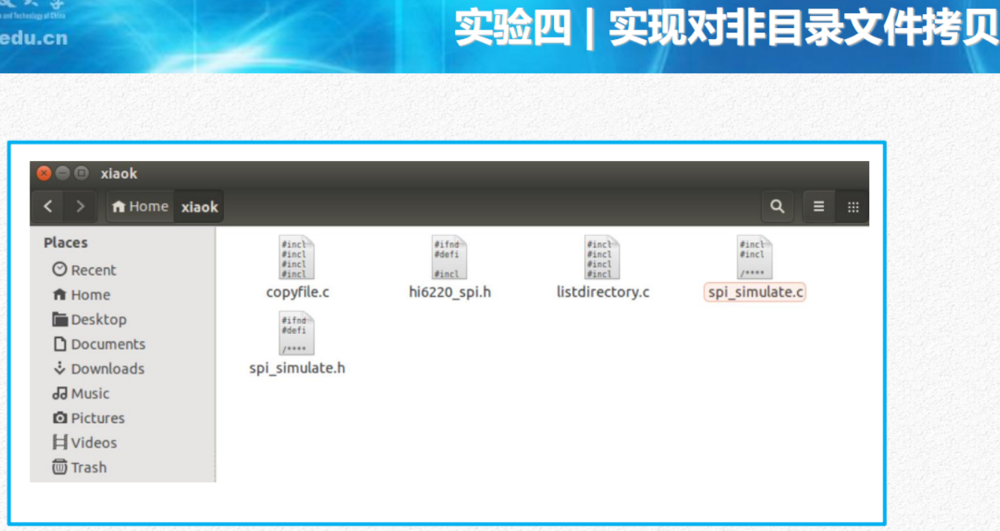
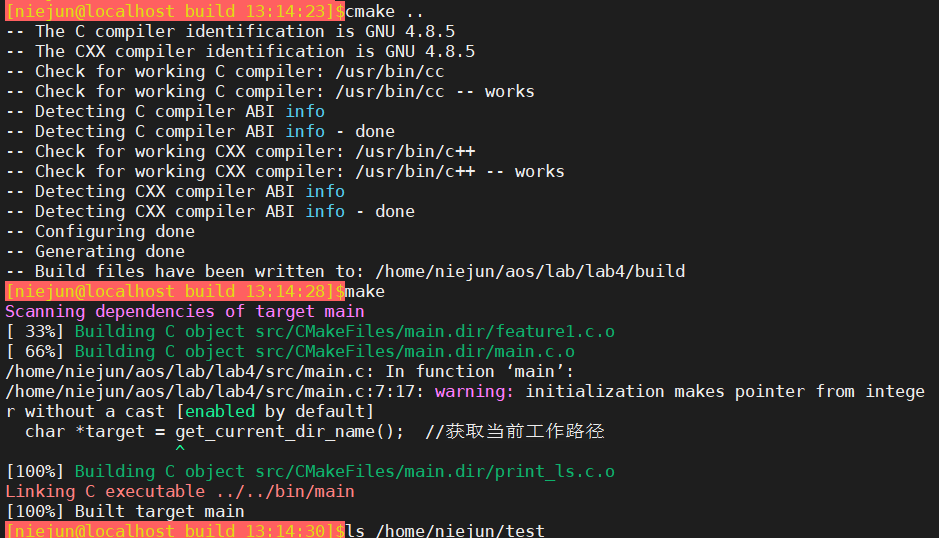
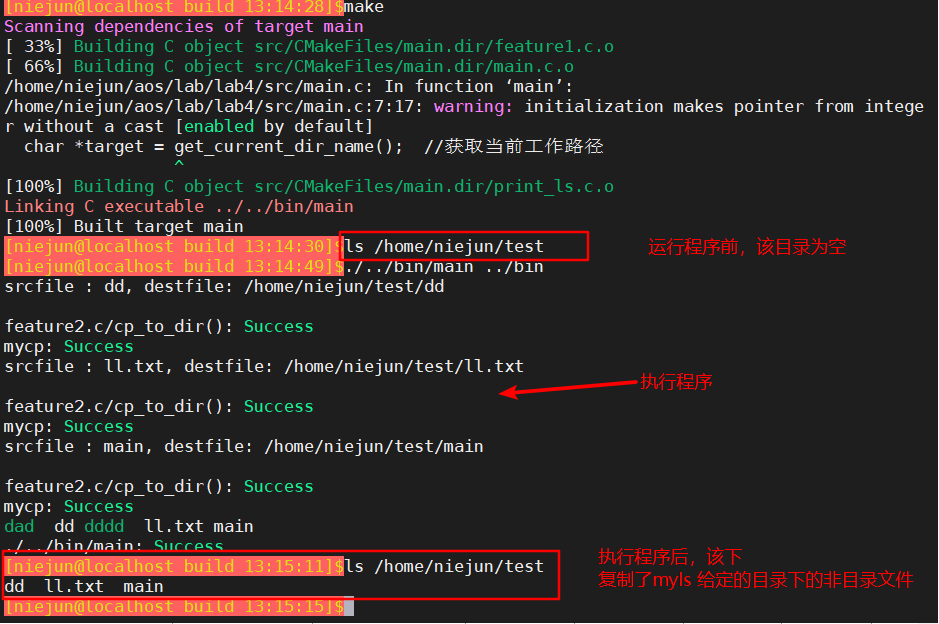

实验四|进程控制实验  2020年3月31日 niejun 006

#### 实验目的

1. 目的一：掌握Linux系统创建进程的方法
2. 目的二：掌握在代码中如何区别父子进程的方法
3. 目的三：掌握父子进程之间的资源共享与异同
4. 目的四：掌握等待子进程执行结束的方法
5. 目的五：掌握在进程中执行另外一个可执行文件的方法

#### 实验内容

基于已经实现的***实验二文件拷贝（mycp）***以及***实验三目录遍历（myls）***
的内容：

##### 1. 改造myls程序作为父进程，其在遍历目录时，对非目录文件创建子进程
   运行mycp程序。
##### 2. mycp源文件路径是父进程myls遍历所获取的文件的路径名（通过命令行
   参数传递给子进程mycp），并将源文件拷贝到指定目录下（在/home目
   录下以自己的名字的汉语拼音创建一个目录）。
##### 3. 父进程myls等待子进程mycp运行结束，回收其内核空间资源，直到父进
   程遍历完成。





#### 实验截图





#### 关键代码

```c
//创建一个子进程，用于复制文件到指定目录
void process_mycp(char *filename)
{

    pid_t pid_child, pid_return;
    pid_child = fork();
    if( pid_child < 0)
    {
    	printf("Error occured on forking.\n");
    }
    else if ( pid_child == 0 )
    {
    	// int result = execlp("src/mycp", "mycp", filename, "/home/niejun/test", NULL);
    	int result = execlp("/home/niejun/aos/lab/lab4/src/mycp", "mycp", filename, "/home/niejun/test", NULL);
    	if ( -1 == result)
    	{
			printf("execlp mycp error!\n");
		}
    	exit(0);
    }
    do{
    	pid_return = waitpid(pid_child, NULL, WNOHANG);

    }while( pid_return == 0 );

    if(pid_return != pid_child)
    {
    	printf("some error occured when wait mycp exiting!\n");
    }
}
```


##### 问题思考

> 2. 如何先打印给定目录的所有文件，再遍历子目录，打印出子目录的所有文件？


