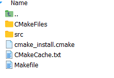
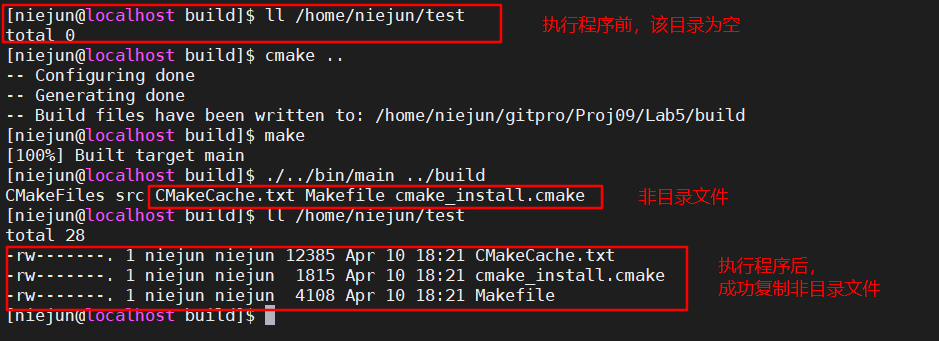

第九组 实验五 | 线程控制实验

#### 实验内容

基于已经实现的实验二文件拷贝（mycp）以及实验三目录遍历（myls）
的内容（与实验四的区别为并发单位变为线程）
1. 改造myls程序作为从属子线程，其在遍历目录时，对非目录文件再次创
建子线程运行mycp程序。
2. mycp源文件路径是父主体线程myls遍历所获取的文件的路径名（通过命
令行参数传递给子进程mycp），并将源文件拷贝到指定目录下（在
/home目录下以自己的名字的汉语拼音创建一个目录）。
3. 线程myls等待线程mycp运行结束，回收其内核空间资源，main线程等
待myls遍历完成，程序结束。

#### 实验截图

要遍历的目录的文件结构



执行程序



#### 关键代码

```c
//创建myls线程，并阻塞等待其完成
pthread_t myls;
int result = pthread_create(&myls,NULL,(void *)myls_with_cp,argv[1]);
if( result != 0){
    printf("thread creation failed\n");
    exit(1);
}
pthread_join(myls,NULL);

//当非目录文件时，创建mycp线程，复制该文件到指定目录，并等待其复制完成
if( S_ISDIR(curr_stat.st_mode) ){
    continue;
}
pthread_t thread_mycp;
int result = pthread_create(&thread_mycp,NULL,(void *)mycp,filename);
if( result != 0){
    printf("thread creation failed\n");
    exit(1);
}
pthread_join(thread_mycp,NULL);

```