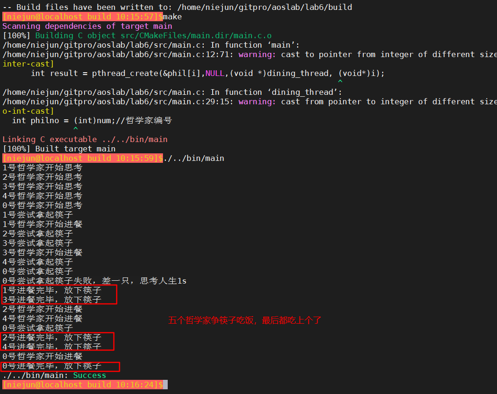

实验六 | 线程同步实验  2020年4月7日  niejun

#### 问题描述

问题描述：五个哲学家共用一张圆桌，分别坐在周围的五张椅子上，在圆桌上有五个碗和五只筷子，他们的生活方式是交替地进行思考和进餐。平时，一个哲学家进行思考，饥饿时便试图取其左右最靠近它的筷子，只有他拿到两只筷子时才能进餐。进餐毕，放下筷子继续思考。

1. 这段描述中有哪些实现的限制
2. 有五个碗和五只筷子，能同时吃饭的只有两位哲学家
3. 哲学家不会谦让，吃饭和思考都没有固定模式。
4. 考虑将哲学家模拟为同一例程的五个线程，筷子是共享的资源。
5. 哲学家的三种状态
  - 想吃饭，筷子都有或者被隔壁拿走了
  - 筷子拿到了开始进餐
  - 饱了，因为是哲学家所以开始思考

------

#### 实验内容

利用POSIX API在Linux系统上编写应用程序，通过多线程和互斥量机制实现哲学家进餐问题（哲学家的数量可以通过简单的配置进行修改）

1. 首先通过阻塞加锁的操作方式实现哲学家之间（线程）对筷子（临界资源）的互斥访问，观察程序运行一段时间以后会出现的死锁状态。如果未出现死锁状态的可以通过修改哲学家数量以及修改延时设置来增大出现死锁的机率。
2. 将互斥量的加锁操作从阻塞方式修改为非阻塞方式，通过让权等待的思想预防死锁状态的出现。


#### 实验截图

执行程序



#### 关键代码

```c
//单个哲学家争夺2只筷子吃饭的过程，只有2只都抢到才吃饭，另一只没抢到则释放资源
while(1){
    printf("%d号尝试拿起筷子\n", philno);
    pthread_mutex_lock(&mutex[philno]);//拿起左筷子
    //判断是否能拿起右筷子，若无法拿起，先释放左筷子，过后再试
    int result = pthread_mutex_trylock(&mutex[(philno+1)%5]);
    if( result != 0) //若拿起右筷子失败，则释放左筷子
    {
        pthread_mutex_unlock(&mutex[philno]);
        printf("%d号尝试拿起筷子失败，差一只，思考人生1s\n", philno);
        sleep(5);
        continue;
    }

    printf("%d号哲学家开始进餐\n", philno);
    sleep(5);
    printf("%d号进餐完毕，放下筷子\n", philno);
    pthread_mutex_unlock(&mutex[(philno+1)%5]);
    pthread_mutex_unlock(&mutex[philno]);
    break;
}
```